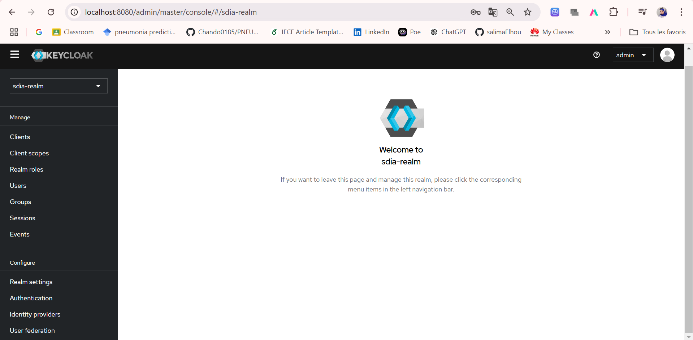
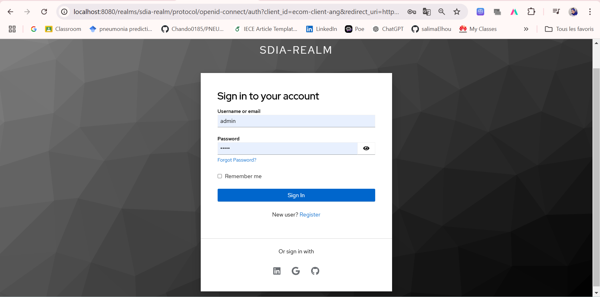

# EL HOU Salima SDIA 2

# Projet : Sécurisation d'une architecture Micro-Service avec Keycloak et Spring Angular

## Table des matières
1. [Introduction](#introduction)
2. [Technologies utilisées](#technologies-utilisées)
3. [Partie 1 : Configuration de Keycloak](#partie-1--configuration-de-keycloak)
4. [Partie 2 : Développement et sécurisation de l'architecture Micro-Service](#partie-2--développement-et-sécurisation-de-larchitecture-micro-service)
5. [Exécution des tests avec Postman](#exécution-des-tests-avec-postman)
6. [Ressources et liens](#ressources-et-liens)

---

## Introduction

Ce projet a pour but de configurer Keycloak pour sécuriser une architecture **Micro-Service** basée sur **Spring Boot** pour le backend et **Angular** pour le frontend. Il comprend deux parties :
1. Configuration et utilisation de Keycloak.
2. Développement et sécurisation d'une application micro-service.

---

## Technologies utilisées

- **Keycloak 26.0.7**
- **Spring Boot** (Backend)
- **Angular** (Frontend)
- **Postman** (Tests d'authentification)
- **JWT** (Access Token & Refresh Token)

---

## Partie 1 : Configuration de Keycloak

### Étapes pour configurer Keycloak :
1. **Télécharger Keycloak 26.0.7**
    - [Lien de téléchargement](https://www.keycloak.org/downloads).

2. **Démarrer Keycloak**
    - Commande pour démarrer Keycloak (mode développement) :
      ```bash
       docker run -p 8080:8080 -e KC_BOOTSTRAP_ADMIN_USERNAME=admin -e KC_BOOTSTRAP_ADMIN_PASSWORD=admin quay.io/keycloak/keycloak:26.0.7 start-dev
      ```

3. **Créer un compte Admin**
    - Accédez à **http://localhost:8080** et suivez les étapes pour créer un compte administrateur.

4. **Créer une Realm**
    - Créez une nouvelle Realm nommée `realm-sdia`.


5. **Créer un client sécurisé**
    - Exemple de client : `ecom-client-ang` avec accès public ou confidentiel.

   
6. **Créer des utilisateurs**
    - Ajoutez des utilisateurs avec des informations de base (username, email, etc.).


7. **Créer et attribuer des rôles**
    - Exemple de rôles : `ADMIN`, `USER`.
    - Affectez ces rôles aux utilisateurs.

---

## Exécution des tests avec Postman

### Tester l'authentification avec les JWT
1. **Récupération d'un Access Token avec mot de passe** :
    - Méthode : **POST**
    - URL : `http://localhost:8080/realms/sdia-realm/protocol/openid-connect/token`
    - Paramètres requis :
      ```json
      {
        "grant_type": "password",
        "client_id": "micro-service-client",
        "username": "user1",
        "password": "mypassword"
      }
      ```


2. **Analyser Access Token et Refresh Token**
    - Utilisez des outils comme [jwt.io](https://jwt.io/) pour décoder les tokens.
   


3. **Tester l'authentification avec Refresh Token**
    - Envoyez le Refresh Token pour obtenir un nouvel Access Token.

4. **Tester avec Client ID et Secret**
    - Ajoutez les paramètres `client_id` et `client_secret` pour authentification confidentielle.


5. **Changer les paramètres des Tokens**
    - Modifiez la durée de vie des **Access Token** et **Refresh Token** dans Keycloak.

---

## Partie 2 : Développement et sécurisation de l'architecture Micro-Service

### Étapes de développement :
1. **Backend : Spring Boot**
    - Configurez un serveur Spring Boot avec sécurité Keycloak.
   

2. **Frontend : Angular**
    - Implémentez l'authentification via Keycloak dans Angular.
    - Utilisez la bibliothèque **keycloak-js** pour intégrer Keycloak.




3. **Configuration de sécurité**
    - Ajoutez les annotations de sécurité (`@PreAuthorize`, `@RolesAllowed`) pour sécuriser les endpoints.

---

## Ressources et liens

- Documentation Keycloak : [Keycloak Official Docs](https://www.keycloak.org/documentation)

---

## Auteur

- **EL HOU Salima**
- **[LinkedIn](https://www.linkedin.com/in/salima-el-hou-883294235/)**

---

